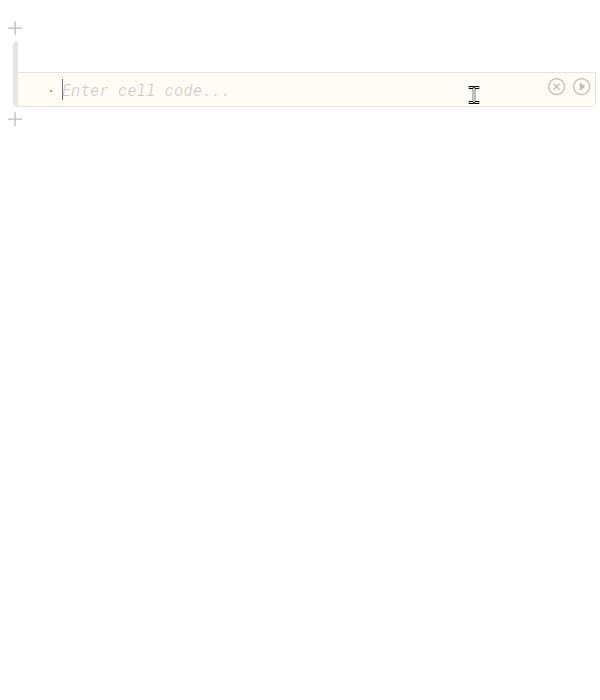
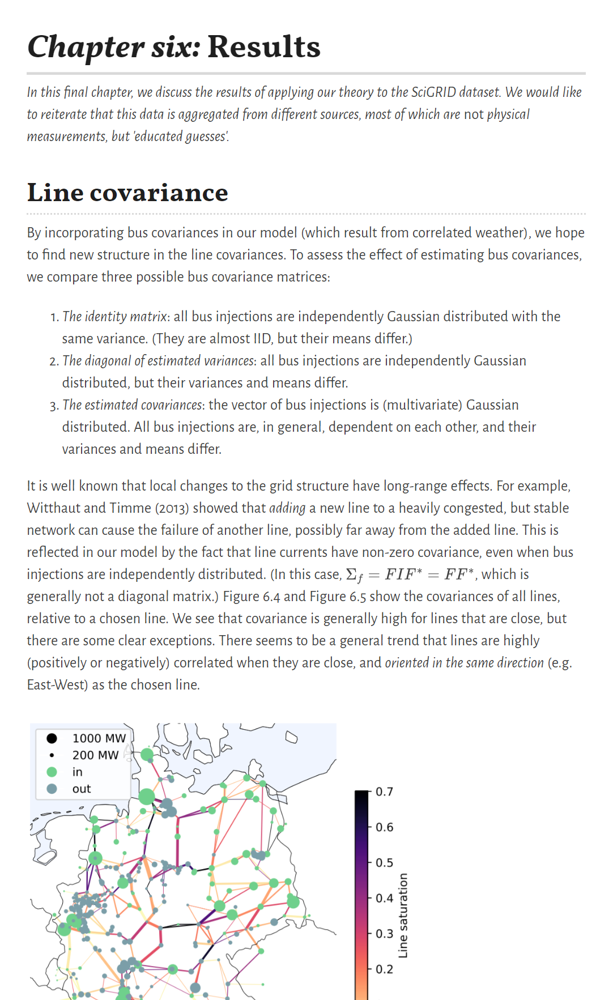
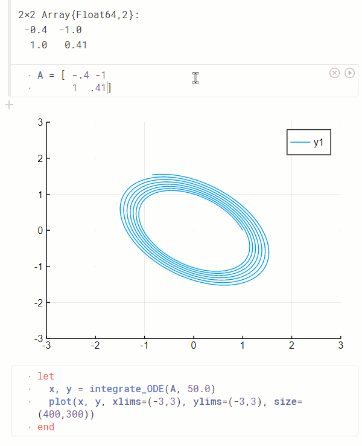

<h1></h1>

Lightweight ***reactive*** notebooks for Julia ⚡ - welcome to Pluto!

_**Explore models and share results** in a notebook that is_
- **_reactive_** - when changing a function or variable, Pluto automatically updates all affected cells.
- **_lightweight_** - Pluto is written in pure Julia and is an installable package.
- **_modern_** - responsive, intuitive user experience; beautiful exported documents; custom themes.




## Input

The central idea is that Pluto notebooks are ***reactive***, just like [Observable notebooks](https://observablehq.com/@observablehq/observables-not-javascript), but using Julia instead of JavaScript. Cells can be placed in any order - our intelligent AST parser figures out the dependencies between them and takes care of execution. When you change a variable, Pluto automatically re-runs the cells that refer to it.

Unlike Jupyter or Matlab, there is **no mutable workspace**, but rather a _one-to-one corresponce_ between variables and code. In a Pluto notebook, the value of a variable _always_ corresponds to the code that defines it.

## Output

Cell output is simple: one cell outputs one variable, which is displayed using the richest available formatter. We believe that this limitation actually [_makes programming easier_](https://medium.com/@mbostock/a-better-way-to-code-2b1d2876a3a0)!

Your notebooks are saved as pure Julia files, which you can then import as if you had been programming in a regular editor all along. You can also export your notebook with output as attractive HTML and PDF documents. By reordering cells and hiding code, you have full control over how you tell your story.



## Installation

_(To developers: follow [these instructions](https://github.com/fonsp/Pluto.jl/blob/master/dev_instructions.md) to start working on the package.)_

After [installing julia](https://julialang.org/), add the package:
```julia
julia> ]
(v1.0) pkg> add Pluto
```

To run the notebook server:
```julia
julia> using Pluto
julia> Pluto.run(1234)
```

Then go to [`http://localhost:1234/`](http://localhost:1234/) to start coding!



## Note

This package is still in its early days - go to the [issue tracker](https://github.com/fonsp/Pluto.jl/issues) to see what's up!

Let us know what you think! 😊


## FAQ

### What's the deal with reactivity?
Programming is hard sometimes. Even more so when you need to keep track not only of your code, but also of your session's hidden state. Pluto gives you confidence that the code you see exactly matches the variables you're working with, eliminating bugs before you even knew you had them.

### Okay, but doesn't this impede performance?
Au contraire! Pluto automatically figures out the dependencies for you and re-runs _only the affected cells_, meaning that you don't have to press "run all below" as you would in a non-reactive notebook. If you're expecting a cell update to take long, you can always abstain from runing your cells until you get everything right - and then our smart "run all" button will know which cells you _actually_ want to run.

### Why is it so cool to have cells in any order?
Nobody wants their code getting in the way of their ideas. Pluto lets you organize your code into sections in any way you like, without a nasty cell full of `import`s and `using`s at the beginning of your beautiful work.

_Created by [**Fons van der Plas**](https://github.com/fonsp) and [**Mikołaj Bochenski**](https://github.com/malyvsen). Inspired by [Observable](https://observablehq.com/)._
