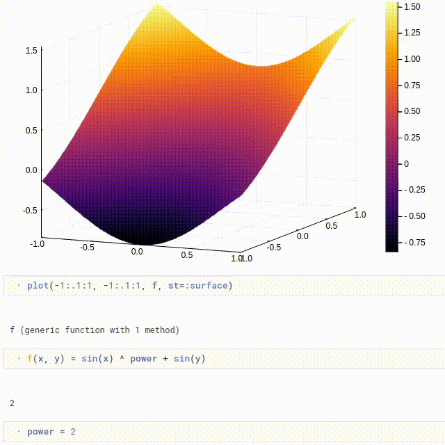
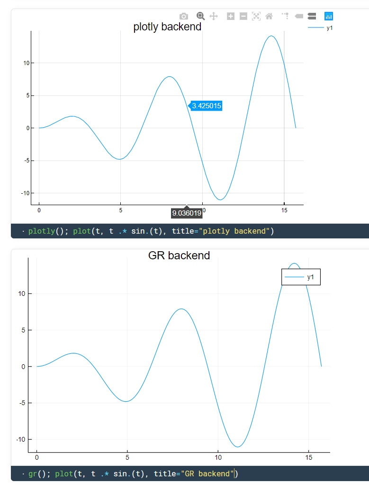

<h1></h1>

Lightweight ***reactive*** notebooks for Julia ⚡ - welcome to Pluto!

_**Explore models and share results** in a notebook that is_
- **_reactive_** - when changing a function or variable, Pluto automatically updates all affected cells.
- **_lightweight_** - Pluto is written in pure Julia and is an installable package.
- **_modern_** - responsive, intuitive user experience; beautiful exported documents; custom themes.




## Input

The central idea is that Pluto notebooks are ***reactive***, just like [Observable notebooks](https://observablehq.com/@observablehq/observables-not-javascript), but using Julia instead of JavaScript. Cells can be placed in any order - our intelligent AST parser figures out the dependencies between them and takes care of execution. When you change a variable, Pluto automatically re-runs the cells that refer to it.


## Output

Cell output is simple: one cell outputs one variable, which is displayed using the richest available formatter. We believe that this limitation actually [_makes programming easier_](https://medium.com/@mbostock/a-better-way-to-code-2b1d2876a3a0)!


Plotting is supported out-of-the-box!



Your notebooks are saved as pure Julia files, which you can then import as if you had been programming in a regular editor all along.


## Installation

_(To developers: follow [these instructions](https://github.com/fonsp/Pluto.jl/blob/master/dev_instructions.md) to start working on the package.)_

To add the package:
```julia
julia> using Pkg; Pkg.add(PackageSpec(url="https://github.com/fonsp/Pluto.jl"))
```

To run the notebook server:
```julia
julia> using Pluto
julia> Pluto.serve_notebook(1234)
```

Then go to [`http://localhost:1234/`](http://localhost:1234/) to start coding!

## Note

This package is still in its early days - go to the [issue tracker](https://github.com/fonsp/Pluto.jl/issues) to see what's up!

Let us know what you think! 😊

_Created by [**Fons van der Plas**](https://github.com/fonsp) and [**Mikołaj Bochenski**](https://github.com/malyvsen). Inspired by [Observable](https://observablehq.com/)._
